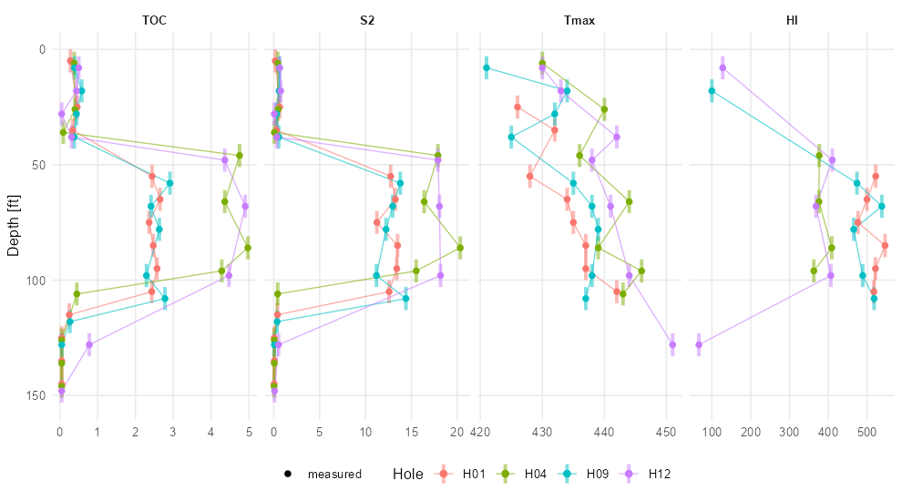
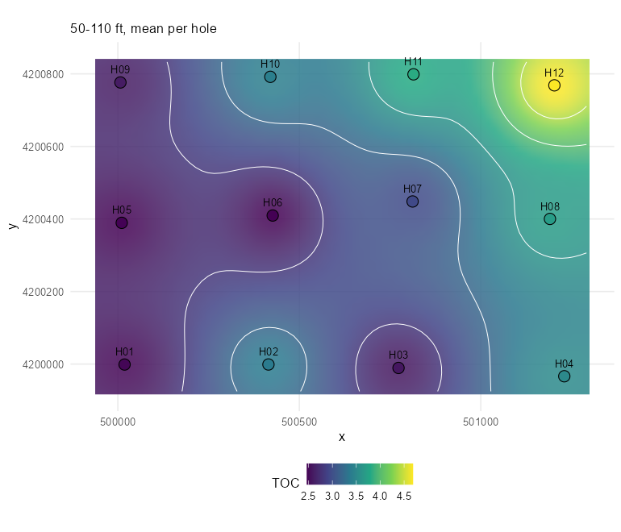
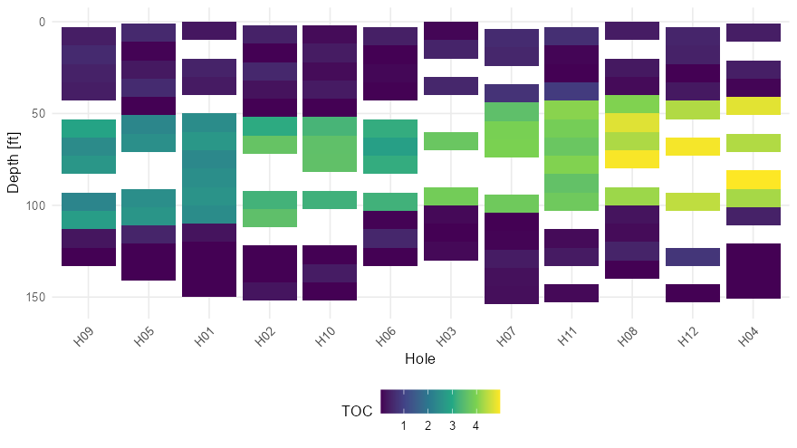

# geochemR

[](https://github.com/mjorden/geochemR/actions/workflows/R-CMD-check.yaml)

Import, process and map sample-based geochemistry — **XRD** mineralogy,
**XRF** element / oxide chemistry and **source-rock analyzer (Rock-Eval)
pyrolysis** (S1, S2, S3, Tmax, TOC) — from boreholes, wells and outcrops.
One tidy data model, readers that cope with real laboratory spreadsheets
(mineral name variants, `Zr_ppm` suffixes, `<5` censored values), the usual
processing steps and derived indices, and `ggplot2` plots in depth and in
plan.

```r
# install.packages("remotes")
remotes::install_github("mjorden/geochemR")
```

## In one screen

```r
library(geochemR)

ds <- gc_example                      # 12 holes x 15 intervals, XRD + XRF + SRA (synthetic)
ds
#> <gc_data> 180 samples in 12 holes; 4205 measurements
#>   methods: SRA (633), XRD (1232), XRF (2340)
#>   censored (<LOD): 86

ds <- ds |>
  gc_substitute_lod("half") |>        # < LOD -> LOD / 2 (qualifier kept)
  gc_indices()                        # HI, OI, PI, Ro_eq, CIA, Si/Al, carbonate, clay, brittleness ...

plot_depth_profile(ds, "SRA", c("TOC", "S2", "Tmax", "HI"), holes = c("H01", "H04", "H09", "H12"))
plot_map(ds, "SRA", "TOC", depth = c(50, 110))
```



*Depth profiles: one panel per analyte, holes as colours, interval samples
drawn over their interval, censored values hollow.*

 

*Left: planar map of mean TOC over 50–110 ft per hole with an
inverse-distance surface and contours. Right: interpolated cross-section
along H01 → H04.*

 

*Left: pseudo-van Krevelen (HI vs OI) with Type I / II / III trends. Right:
quartz – carbonate – clay ternary from the XRD, coloured by depth.*



## The data model

A `gc_data` object holds two tibbles: `samples` (one row per physical
sample — `sample_id`, `hole_id`, `x`, `y`, `z`, `depth_top`, `depth_base`,
`sample_type`) and `measurements` (one row per sample × analyte —
`method`, `analyte`, `value`, `unit`, `lod`, `qualifier`, `lab`). Lab
results are samples, not curves: tens per hole, at a depth or over an
interval, from a lab by a method, and keeping every method in one long
table means one set of tools for validation, joins and plotting.

```r
samples <- read_samples("locations.csv")                   # sample_id, hole, x, y, depth ...
xrd     <- read_xrd("xrd_results.xlsx", lab = "Lab A")     # wide: Quartz, K-Feldspar, I/S, ...
xrf     <- read_xrf("xrf_results.csv",  lab = "Lab B")     # wide: SiO2, Al2O3, ..., Zr_ppm, "<5"
sra     <- read_sra("pyrolysis.csv",    lab = "Lab C")     # wide: TOC, S1, S2, S3, Tmax
ds      <- gc_data(samples, dplyr::bind_rows(xrd, xrf, sra), crs = 26914)
```

`gc_data()` validates on construction — unknown sample ids and inverted
depths are errors; XRD totals far from 100, values below their own detection
limit without a `<`, and duplicate rows are warnings — so a spreadsheet
problem surfaces at import, not on a map.

## What is in the box

| | Functions |
|---|---|
| **Read** | `read_samples()`, `read_xrd()`, `read_xrf()`, `read_sra()`, `read_geochem()`; `gc_mineral_name()` for lab spellings; `.parse_values()` for `<5` / `n.d.` |
| **Model** | `gc_data()`, `validate_gc()`, `gc_samples()`, `gc_measurements()`, `gc_analytes()`, `gc_wide()`, `gc_bind()` |
| **Process** | `gc_substitute_lod()` (half / √2 / LOD / zero), `gc_convert_units()` (wt% ↔ ppm ↔ ppb), `gc_oxide_to_element()` / `gc_element_to_oxide()`, `gc_renormalize()`, `gc_clr()` / `gc_alr()` (log-ratio transforms for compositional data), `gc_interval_stats()`, `gc_hole_summary()` |
| **Indices** | `gc_indices()`: HI, OI, PI, S1/TOC, Ro-equivalent from Tmax (Jarvie 2001); CIA, Si/Al, K/Al, Ti/Al; carbonate, clay, QFM, mineralogical brittleness (Wang & Gale 2009) |
| **Depth** | `plot_depth_profile()`, `plot_depth_heatmap()`, `plot_section()` (IDW on a distance–depth grid), `plot_mineralogy()` |
| **Plan** | `plot_map()` (per-hole summary over a depth window, IDW surface + contours), `gc_idw()` |
| **Cross-plots** | `plot_ternary()` (no extra package), `plot_kerogen()` (HI–OI, HI–Tmax with maturity windows, S2–TOC) |
| **Data** | `gc_example` (synthetic), `gc_minerals`, `gc_oxides`, `gc_sra_analytes` |

Every plot returns a `ggplot` you can keep styling.

## Notes on the science

* **Censoring.** `"<5"` is read as `value = 5, lod = 5, qualifier = "<"` and
  left alone until you choose a substitution; the qualifier survives so a
  substituted value can always be told from a measured one.
* **Compositions.** Mineral and oxide percentages sum to a constant, so
  correlations on the raw parts are distorted; `gc_clr()` gives you
  Aitchison's centred log-ratios for anything statistical.
* **Neutron-free.** Nothing here touches wireline logs; joining samples to
  logs is the job of [LASanalysis](https://github.com/mjorden/LASanalysis)
  on the Python side.
* **CIA** uses CaO uncorrected for carbonate — meaningful for carbonate-poor
  samples only. **Ro_eq** from Tmax is the Jarvie et al. (2001) line and is
  reported only for 400–500 °C.
* **Interpolation** is plain inverse-distance weighting on hole summaries,
  meant for looking, not for resource estimation; `plot_section()` scales
  depth by `aspect` so the search is roughly isotropic in section units.

## Development

```r
devtools::load_all(); testthat::test_dir("tests/testthat")   # 143 tests
source("data-raw/make_example.R")                               # rebuild gc_example
```

Pure R, no compiled code. Suggested: `readxl` for Excel input, `sf` if you
want to reproject coordinates before mapping.
