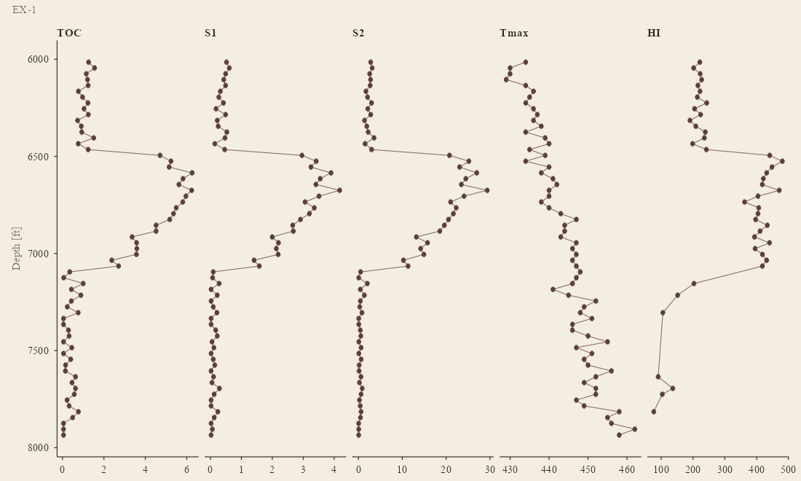
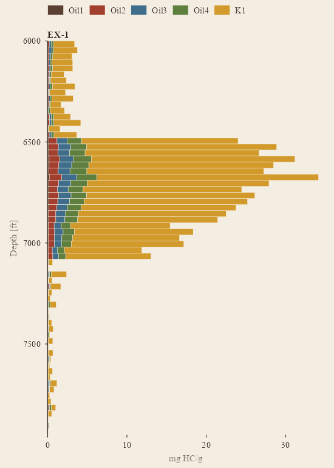
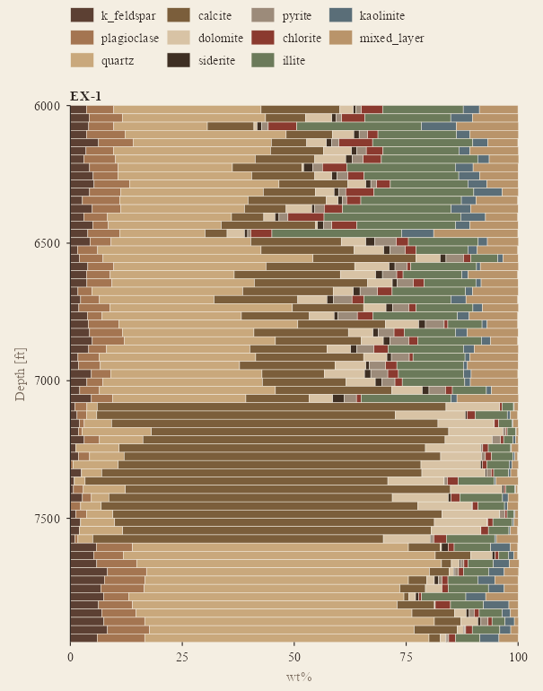
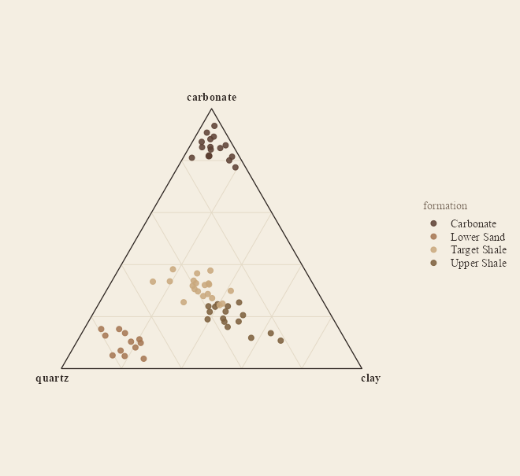
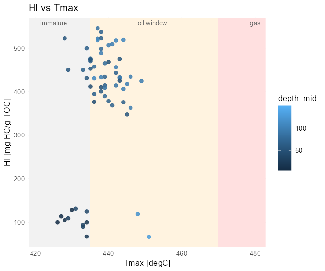
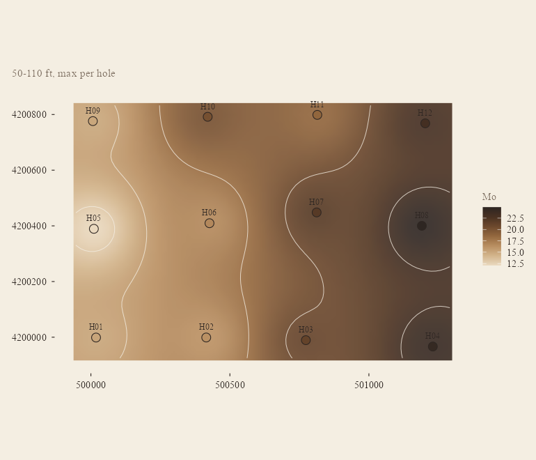
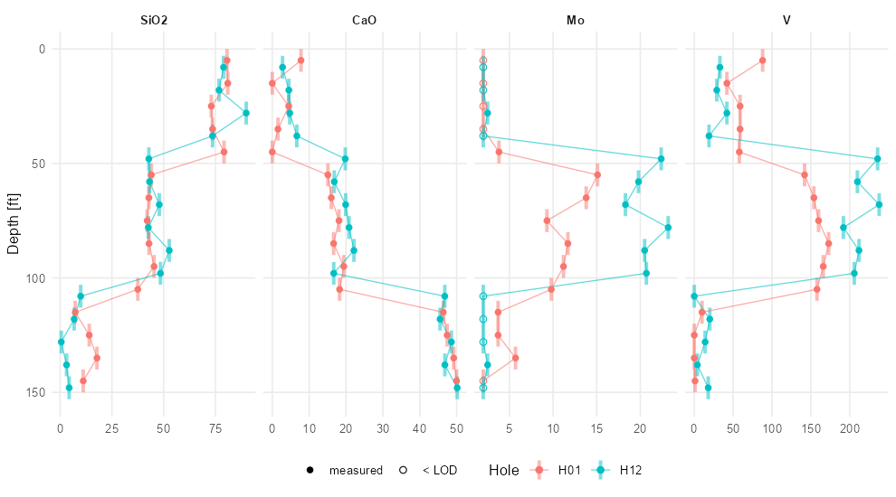

# geochemR

[](https://github.com/mjorden/geochemR/actions/workflows/R-CMD-check.yaml)
[](https://mjorden.github.io/geochemR/)
[](LICENSE.md)

Import, process and map sample-based geochemistry — **XRD** mineralogy,
**XRF** element / oxide chemistry and **source-rock analyzer (Rock-Eval)
pyrolysis** (S1, S2, S3, Tmax, TOC) — from boreholes, wells and outcrops.
One tidy data model, readers that cope with real laboratory spreadsheets
(mineral name variants, `Zr_ppm` suffixes, `<5` censored values), the usual
processing steps and derived indices, and `ggplot2` plots in depth and in
plan.

**Documentation:** <https://mjorden.github.io/geochemR/> — reference by
task, and the [get-started article](https://mjorden.github.io/geochemR/articles/geochemR.html).

```r
# install.packages("remotes")
remotes::install_github("mjorden/geochemR")
```

## In one screen

```r
library(geochemR)

ds <- gc_example                      # 12 holes x 15 intervals, XRD + XRF + SRA (synthetic)
ds
#> <gc_data> 180 samples in 12 holes; 4951 measurements
#>   methods: SRA (631), XRD (1980), XRF (2340)
#>   censored (<LOD): 85

ds <- ds |>
  gc_substitute_lod("half") |>        # < LOD -> LOD / 2 (qualifier kept)
  gc_indices()                        # HI, OI, PI, Ro_eq, CIA, Si/Al, carbonate, clay, brittleness ...

plot_depth_profile(ds, "SRA", c("TOC", "S2", "Tmax", "HI"), holes = c("H01", "H04", "H09", "H12"))
plot_map(ds, "SRA", "TOC", depth = c(50, 110))
```


*`plot_depth_profile()`: one panel per analyte, holes as colours, interval
samples drawn over their interval, censored values hollow.*

 

*`plot_map()`: mean TOC over 50–110 ft per hole on an inverse-distance
surface with contours. `plot_section()`: interpolated cross-section along
H01 → H04, sample bins marked.*

## Your own data

**A whole deliverable workbook.** Commercial cuttings-analysis reports put
every method on one sheet — a *group* row (`SAMPLE INFO`, `TOC`,
`TRADITIONAL PYROLYSIS`, `PAM PYROLYSIS`, `XRD BULK MINERALOGY`, `XRD CLAY
SPECIATION`, `XRF ELEMENTAL CONCENTRATIONS`), an *analyte* row, a *unit*
row, a QC row, then one sample per row with the bottom depth of each
cuttings interval and formation / zone labels. `read_workbook()` reads that
layout in one call; the package ships a synthetic workbook in exactly that
form.

```r
f  <- system.file("extdata", "cuttings_workbook.xlsx", package = "geochemR")
cu <- read_workbook(f, hole_id = "EX-1", lab = "Example Cuttings Lab") |> gc_indices()
#> read_workbook(): clay speciation reported relative to total clay; converted to bulk wt%
cu
#> <gc_data> 65 samples in 1 holes; 3640 measurements
#>   methods: PAM (650), SRA (390), XRD (780), XRF (1820)

plot_depth_profile(cu, "SRA", c("TOC", "S1", "S2", "Tmax", "HI"))
plot_pam(cu)                                             # stacked multi-ramp pyrolysis fractions
gc_hole_summary(cu, "SRA", by = c("hole_id", "formation"), analytes = c("TOC", "HI", "Tmax"))
```



  

*One cuttings well through four formations: `plot_pam()` (light
hydrocarbons at the base of each bar, kerogen on top), `plot_mineralogy()`,
and the quartz–carbonate–clay ternary coloured by formation.*

**Three separate tables.** Otherwise one wide table per method — one row per
sample — is all a lab usually sends. The readers match column names
case-insensitively, with aliases, and tell you what they ignored.

```r
samples <- read_samples("locations.csv")
#   sample_id | hole (or well / borehole / station / api) | x, y (or easting, northing, lon, lat)
#   z (elevation, optional) | depth_top (or depth / top / from) | depth_base (optional) | sample_type

xrd <- read_xrd("xrd.xlsx", lab = "Lab A")
#   sample | Quartz | K-Feldspar | Plagioclase | Calcite | Dolomite | Pyrite | Illite/Mica | I/S | Kaolinite | Chlorite | Total Clay
#   -> canonical names via gc_minerals (k_feldspar, mixed_layer, illite, total_clay, ...)

xrf <- read_xrf("xrf.csv", lab = "Lab B")
#   sample | SiO2 | Al2O3 | ... | LOI | Zr_ppm | V (ppm) | Mo_ppm
#   -> units from suffixes; "<2" -> value 2, lod 2, qualifier "<"; "n.d." -> NA

sra <- read_sra("pyrolysis.csv", lab = "Lab C")
#   sample | TOC (wt%) | S1 | S2 | S3 | Tmax  (Ro / VR optional)

ds <- gc_data(samples, dplyr::bind_rows(xrd, xrf, sra), crs = 26914, depth_unit = "ft")
```

`gc_data()` validates on construction — unknown sample ids and inverted
depths are errors; XRD totals far from 100, values below their own detection
limit without a `<`, and duplicate rows are warnings — so a spreadsheet
problem surfaces at import, not on a map. `gc_wide(ds, "XRF")` gets you back
to one row per sample whenever you want it.

## Gallery

 

*`plot_kerogen()`: pseudo-van Krevelen (HI vs OI) with Type I / II / III
trends, and HI vs Tmax with immature / oil / gas windows for the cuttings
well, coloured by formation.*

 

*`plot_ternary()`: quartz – carbonate – clay from the XRD, no extra package.
`plot_map(fun = max)`: hottest Mo sample per hole over the mudstone.*


*`plot_depth_heatmap()`: holes ordered west → east, TOC by interval.*

 

*`plot_mineralogy()`: stacked XRD composition by interval.
`plot_depth_profile()` on XRF: major oxides and censored trace elements.*

## What is in the box

| | Functions |
|---|---|
| **Read** | `read_samples()`, `read_xrd()`, `read_xrf()`, `read_sra()`, `read_geochem()`; `gc_mineral_name()` for lab spellings; `.parse_values()` for `<5` / `n.d.` |
| **Model** | `gc_data()`, `validate_gc()`, `gc_samples()`, `gc_measurements()`, `gc_analytes()`, `gc_wide()`, `gc_bind()` |
| **Process** | `gc_substitute_lod()` (half / √2 / LOD / zero), `gc_convert_units()` (wt% ↔ ppm ↔ ppb), `gc_oxide_to_element()` / `gc_element_to_oxide()`, `gc_renormalize()`, `gc_clr()` / `gc_alr()` (log-ratio transforms for compositional data), `gc_interval_stats()`, `gc_hole_summary()` |
| **Indices** | `gc_indices()`: HI, OI, PI, S1/TOC, Ro-equivalent from Tmax (Jarvie 2001); CIA, Si/Al, K/Al, Ti/Al; carbonate, clay, QFM, mineralogical brittleness (Wang & Gale 2009) |
| **Depth** | `plot_depth_profile()`, `plot_depth_heatmap()`, `plot_section()` (IDW on a distance–depth grid), `plot_stacked_depth()`, `plot_mineralogy()`, `plot_pam()` |
| **Plan** | `plot_map()` (per-hole summary over a depth window, IDW surface + contours), `gc_idw()` |
| **Cross-plots** | `plot_ternary()`, `plot_kerogen()` (HI–OI, HI–Tmax with maturity windows, S2–TOC) |
| **Look** | `theme_gc()`, `scale_colour_gc()` / `scale_fill_gc()` / `..._gc_c()`, `scale_fill_minerals()`, `gc_colours()`, `gc_pal()`, `gc_mineral_colours` |
| **Data** | `gc_example` (12 holes), `gc_cuttings` (one cuttings well + its workbook), `gc_minerals`, `gc_oxides`, `gc_sra_analytes`, `gc_pam_analytes` |

Every plot returns a `ggplot` you can keep styling.

## The look

Plots are drawn with `theme_gc()`: a parchment page, brown ink, serif type —
a sibling of the *academic* style in
[econscape](https://github.com/mjorden/econscape) — with Tufte's restraint
layered on: no panel fill behind the data, no gridlines unless asked for,
hairline axes with outward ticks, muted axis titles, a legend that reads as
a row of labels, and on depth profiles of two or three holes the hole names
written at the bottom of each trace instead of a legend.

The furniture being monochrome is what lets the data carry colour. The
categorical palette rotates through distinct hues muted for parchment
(espresso, rust, slate, moss, ochre, plum, teal, …); continuous scales use
the multi-hue `"scholar"` ramp — sand through ochre and rust to plum and
ink, luminance falling monotonically — so that both the level and the
gradient of a map read (`"tide"` for a cool version, `"divergent"` for
anomalies about a centre); and XRD minerals are coloured by kind
(`gc_mineral_colours`: silicates warm, carbonates blue, clays green,
sulfides dark). `theme_gc(grid = "y", panel = "parchment")` moves the
furniture back toward econscape; `gc_colours()` and `gc_pal()` expose the
palettes.

## Notes on the science

* **Censoring.** `"<5"` is read as `value = 5, lod = 5, qualifier = "<"` and
  left alone until you choose a substitution; the qualifier survives so a
  substituted value can always be told from a measured one.
* **Lean samples.** HI, OI and S1/TOC are not reported below 0.5 % TOC
  (`gc_indices(min_toc = )`) — the ratios blow up, and laboratories leave
  them blank there too.
* **Compositions.** Mineral and oxide percentages sum to a constant, so
  correlations on the raw parts are distorted; `gc_clr()` gives you
  Aitchison's centred log-ratios for anything statistical.
* **CIA** uses CaO uncorrected for carbonate — meaningful for carbonate-poor
  samples only. **Ro_eq** from Tmax is the Jarvie et al. (2001) line and is
  reported only for 400–500 °C.
* **Interpolation** is plain inverse-distance weighting on hole summaries,
  meant for looking, not for resource estimation; `plot_section()` scales
  depth by `aspect` so the search is roughly isotropic in section units.
* **Logs are elsewhere.** Nothing here touches wireline curves; joining
  samples to logs is [LASanalysis](https://github.com/mjorden/LASanalysis)
  on the Python side.

## Development

```r
devtools::load_all(); testthat::test_dir("tests/testthat")   # 219 tests
source("data-raw/make_example.R")                               # rebuild gc_example
source("data-raw/make_cuttings.R")                              # rebuild gc_cuttings + its workbook
pkgdown::build_site()                                           # the documentation site
```

Pure R, no compiled code. Suggested: `readxl` for Excel input, `sf` if you
want to reproject coordinates before mapping. The README figures are
rendered from `gc_example` by a script, so they cannot drift from what the
code draws.
