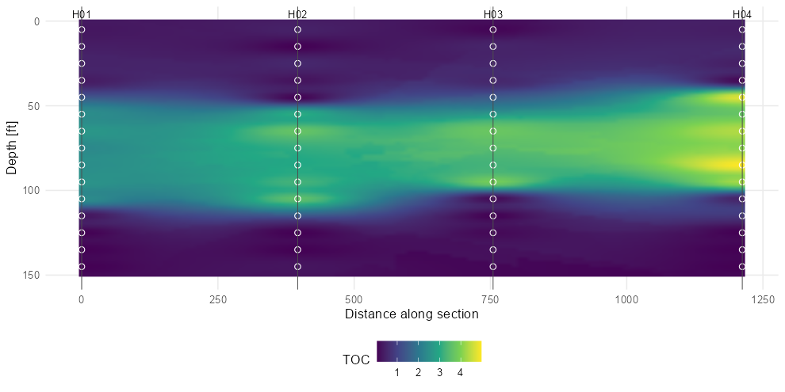
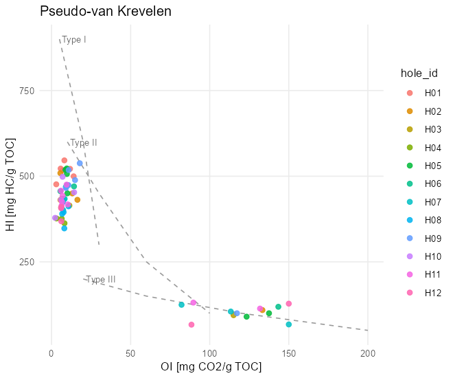
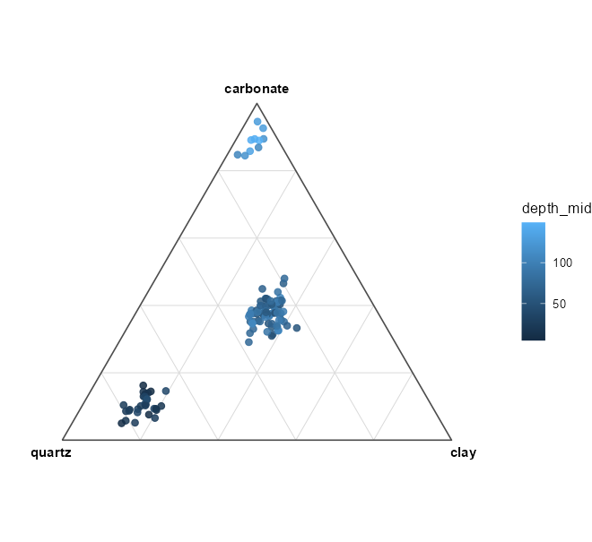
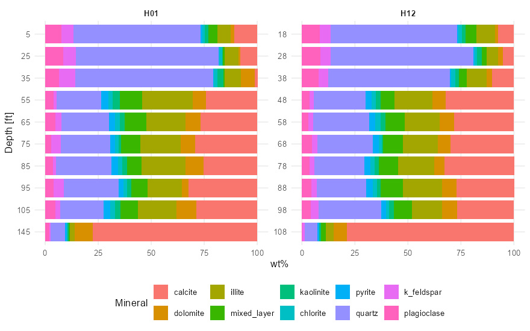

# geochemR

[](https://github.com/mjorden/geochemR/actions/workflows/R-CMD-check.yaml)
[](https://mjorden.github.io/geochemR/)
[](https://mjorden.github.io/geochemR/LICENSE.md)

Import, process and map sample-based geochemistry — **XRD** mineralogy,
**XRF** element / oxide chemistry and **source-rock analyzer (Rock-Eval)
pyrolysis** (S1, S2, S3, Tmax, TOC) — from boreholes, wells and
outcrops. One tidy data model, readers that cope with real laboratory
spreadsheets (mineral name variants, `Zr_ppm` suffixes, `<5` censored
values), the usual processing steps and derived indices, and `ggplot2`
plots in depth and in plan.

**Documentation:** <https://mjorden.github.io/geochemR/> — reference by
task, and the [get-started
article](https://mjorden.github.io/geochemR/articles/geochemR.html).

``` r

# install.packages("remotes")
remotes::install_github("mjorden/geochemR")
```

## In one screen

``` r

library(geochemR)

ds <- gc_example                      # 12 holes x 15 intervals, XRD + XRF + SRA (synthetic)
ds
#> <gc_data> 180 samples in 12 holes; 4205 measurements
#>   methods: SRA (633), XRD (1232), XRF (2340)
#>   censored (<LOD): 86

ds <- ds |>
  gc_substitute_lod("half") |>        # < LOD -> LOD / 2 (qualifier kept)
  gc_indices()                        # HI, OI, PI, Ro_eq, CIA, Si/Al, carbonate, clay, brittleness ...

plot_depth_profile(ds, "SRA", c("TOC", "S2", "Tmax", "HI"), holes = c("H01", "H04", "H09", "H12"))
plot_map(ds, "SRA", "TOC", depth = c(50, 110))
```


Depth profiles

*[`plot_depth_profile()`](https://mjorden.github.io/geochemR/reference/plot_depth_profile.md):
one panel per analyte, holes as colours, interval samples drawn over
their interval, censored values hollow.*



*[`plot_map()`](https://mjorden.github.io/geochemR/reference/plot_map.md):
mean TOC over 50–110 ft per hole on an inverse-distance surface with
contours.
[`plot_section()`](https://mjorden.github.io/geochemR/reference/plot_section.md):
interpolated cross-section along H01 → H04, sample bins marked.*

## Your own data

Three wide tables — one row per sample — are all a lab usually sends.
The readers match column names case-insensitively, with aliases, and
tell you what they ignored.

``` r

samples <- read_samples("locations.csv")
#   sample_id | hole (or well / borehole / station / api) | x, y (or easting, northing, lon, lat)
#   z (elevation, optional) | depth_top (or depth / top / from) | depth_base (optional) | sample_type

xrd <- read_xrd("xrd.xlsx", lab = "Lab A")
#   sample | Quartz | K-Feldspar | Plagioclase | Calcite | Dolomite | Pyrite | Illite/Mica | I/S | Kaolinite | Chlorite | Total Clay
#   -> canonical names via gc_minerals (k_feldspar, mixed_layer, illite, total_clay, ...)

xrf <- read_xrf("xrf.csv", lab = "Lab B")
#   sample | SiO2 | Al2O3 | ... | LOI | Zr_ppm | V (ppm) | Mo_ppm
#   -> units from suffixes; "<2" -> value 2, lod 2, qualifier "<"; "n.d." -> NA

sra <- read_sra("pyrolysis.csv", lab = "Lab C")
#   sample | TOC (wt%) | S1 | S2 | S3 | Tmax  (Ro / VR optional)

ds <- gc_data(samples, dplyr::bind_rows(xrd, xrf, sra), crs = 26914, depth_unit = "ft")
```

[`gc_data()`](https://mjorden.github.io/geochemR/reference/gc_data.md)
validates on construction — unknown sample ids and inverted depths are
errors; XRD totals far from 100, values below their own detection limit
without a `<`, and duplicate rows are warnings — so a spreadsheet
problem surfaces at import, not on a map. `gc_wide(ds, "XRF")` gets you
back to one row per sample whenever you want it.

## Gallery



*[`plot_kerogen()`](https://mjorden.github.io/geochemR/reference/plot_kerogen.md):
pseudo-van Krevelen (HI vs OI) with Type I / II / III trends, and HI vs
Tmax with immature / oil / gas windows, coloured by depth.*



*[`plot_ternary()`](https://mjorden.github.io/geochemR/reference/plot_ternary.md):
quartz – carbonate – clay from the XRD, no extra package.
`plot_map(fun = max)`: hottest Mo sample per hole over the mudstone.*


Hole-by-depth heatmap

*[`plot_depth_heatmap()`](https://mjorden.github.io/geochemR/reference/plot_depth_heatmap.md):
holes ordered west → east, TOC by interval.*



*[`plot_mineralogy()`](https://mjorden.github.io/geochemR/reference/plot_mineralogy.md):
stacked XRD composition by interval.
[`plot_depth_profile()`](https://mjorden.github.io/geochemR/reference/plot_depth_profile.md)
on XRF: major oxides and censored trace elements.*

## What is in the box

|  | Functions |
|----|----|
| **Read** | [`read_samples()`](https://mjorden.github.io/geochemR/reference/read_samples.md), [`read_xrd()`](https://mjorden.github.io/geochemR/reference/read_geochem.md), [`read_xrf()`](https://mjorden.github.io/geochemR/reference/read_geochem.md), [`read_sra()`](https://mjorden.github.io/geochemR/reference/read_geochem.md), [`read_geochem()`](https://mjorden.github.io/geochemR/reference/read_geochem.md); [`gc_mineral_name()`](https://mjorden.github.io/geochemR/reference/gc_mineral_name.md) for lab spellings; [`.parse_values()`](https://mjorden.github.io/geochemR/reference/dot-parse_values.md) for `<5` / `n.d.` |
| **Model** | [`gc_data()`](https://mjorden.github.io/geochemR/reference/gc_data.md), [`validate_gc()`](https://mjorden.github.io/geochemR/reference/validate_gc.md), [`gc_samples()`](https://mjorden.github.io/geochemR/reference/gc_samples.md), [`gc_measurements()`](https://mjorden.github.io/geochemR/reference/gc_samples.md), [`gc_analytes()`](https://mjorden.github.io/geochemR/reference/gc_samples.md), [`gc_wide()`](https://mjorden.github.io/geochemR/reference/gc_wide.md), [`gc_bind()`](https://mjorden.github.io/geochemR/reference/gc_bind.md) |
| **Process** | [`gc_substitute_lod()`](https://mjorden.github.io/geochemR/reference/gc_substitute_lod.md) (half / √2 / LOD / zero), [`gc_convert_units()`](https://mjorden.github.io/geochemR/reference/gc_convert_units.md) (wt% ↔︎ ppm ↔︎ ppb), [`gc_oxide_to_element()`](https://mjorden.github.io/geochemR/reference/gc_oxide_to_element.md) / [`gc_element_to_oxide()`](https://mjorden.github.io/geochemR/reference/gc_oxide_to_element.md), [`gc_renormalize()`](https://mjorden.github.io/geochemR/reference/gc_renormalize.md), [`gc_clr()`](https://mjorden.github.io/geochemR/reference/gc_clr.md) / [`gc_alr()`](https://mjorden.github.io/geochemR/reference/gc_clr.md) (log-ratio transforms for compositional data), [`gc_interval_stats()`](https://mjorden.github.io/geochemR/reference/gc_interval_stats.md), [`gc_hole_summary()`](https://mjorden.github.io/geochemR/reference/gc_hole_summary.md) |
| **Indices** | [`gc_indices()`](https://mjorden.github.io/geochemR/reference/gc_indices.md): HI, OI, PI, S1/TOC, Ro-equivalent from Tmax (Jarvie 2001); CIA, Si/Al, K/Al, Ti/Al; carbonate, clay, QFM, mineralogical brittleness (Wang & Gale 2009) |
| **Depth** | [`plot_depth_profile()`](https://mjorden.github.io/geochemR/reference/plot_depth_profile.md), [`plot_depth_heatmap()`](https://mjorden.github.io/geochemR/reference/plot_depth_heatmap.md), [`plot_section()`](https://mjorden.github.io/geochemR/reference/plot_section.md) (IDW on a distance–depth grid), [`plot_mineralogy()`](https://mjorden.github.io/geochemR/reference/plot_mineralogy.md) |
| **Plan** | [`plot_map()`](https://mjorden.github.io/geochemR/reference/plot_map.md) (per-hole summary over a depth window, IDW surface + contours), [`gc_idw()`](https://mjorden.github.io/geochemR/reference/gc_idw.md) |
| **Cross-plots** | [`plot_ternary()`](https://mjorden.github.io/geochemR/reference/plot_ternary.md), [`plot_kerogen()`](https://mjorden.github.io/geochemR/reference/plot_kerogen.md) (HI–OI, HI–Tmax with maturity windows, S2–TOC) |
| **Data** | `gc_example` (synthetic), `gc_minerals`, `gc_oxides`, `gc_sra_analytes` |

Every plot returns a `ggplot` you can keep styling.

## Notes on the science

- **Censoring.** `"<5"` is read as `value = 5, lod = 5, qualifier = "<"`
  and left alone until you choose a substitution; the qualifier survives
  so a substituted value can always be told from a measured one.
- **Lean samples.** HI, OI and S1/TOC are not reported below 0.5 % TOC
  (`gc_indices(min_toc = )`) — the ratios blow up, and laboratories
  leave them blank there too.
- **Compositions.** Mineral and oxide percentages sum to a constant, so
  correlations on the raw parts are distorted;
  [`gc_clr()`](https://mjorden.github.io/geochemR/reference/gc_clr.md)
  gives you Aitchison’s centred log-ratios for anything statistical.
- **CIA** uses CaO uncorrected for carbonate — meaningful for
  carbonate-poor samples only. **Ro_eq** from Tmax is the Jarvie et
  al. (2001) line and is reported only for 400–500 °C.
- **Interpolation** is plain inverse-distance weighting on hole
  summaries, meant for looking, not for resource estimation;
  [`plot_section()`](https://mjorden.github.io/geochemR/reference/plot_section.md)
  scales depth by `aspect` so the search is roughly isotropic in section
  units.
- **Logs are elsewhere.** Nothing here touches wireline curves; joining
  samples to logs is
  [LASanalysis](https://github.com/mjorden/LASanalysis) on the Python
  side.

## Development

``` r

devtools::load_all(); testthat::test_dir("tests/testthat")   # 147 tests
source("data-raw/make_example.R")                               # rebuild gc_example
pkgdown::build_site()                                           # the documentation site
```

Pure R, no compiled code. Suggested: `readxl` for Excel input, `sf` if
you want to reproject coordinates before mapping. The README figures are
rendered from `gc_example` by a script, so they cannot drift from what
the code draws.
